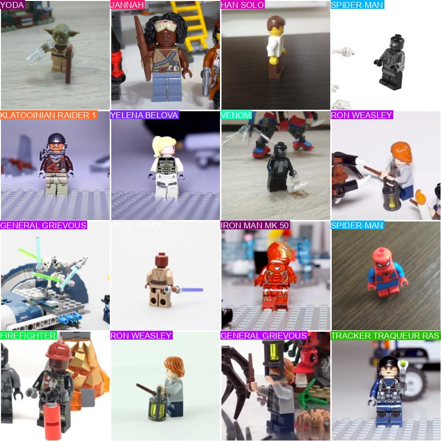
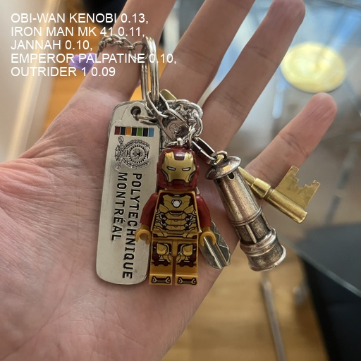

# LEGO Minifigures Classification

## Overview

This project employs computer vision techniques to classify images of LEGO minifigures, including a manually created class for an Iron Man Keyring, demonstrating the practical application of deep learning in image recognition tasks.

## Project Goals

The primary objective is to develop a model capable of accurately categorizing images of LEGO minifigures into 38 distinct classes, including the original 37 classes from [Yaroslav Isaienkov's Kaggle dataset](https://www.kaggle.com/datasets/ihelon/lego-minifigures-classification) and an additional class for the Iron Man Keyring. The project aims to showcase the effectiveness of deep learning models in classifying small-scale image datasets.

## Dataset

The dataset comprises images of LEGO minifigures obtained from Yaroslav Isaienkov's collection on Kaggle. It consists of 37 original classes, with an extra class manually created for the Iron Man Keyring. Each image is annotated with the corresponding class label.

## Preprocessing Steps

Two notebooks are included in the repository: one for dataset preprocessing, which involves formatting the data to a structure suitable for training with the YOLOv8 classifier, and another for model training and evaluation.
```
dataset/
|
|-- train/
|   |-- class1/
|   |   |-- 001.png
|   |   |-- 002.png
|   |   |-- ...
|   |
|   |-- class2/
|   |   |-- 001.png
|   |   |-- 002.png
|   |   |-- ...
|   |
|   |-- ...
|
|-- val/
|   |-- class1/
|   |   |-- 001.png
|   |   |-- 002.png
|   |   |-- ...
|   |
|   |-- class2/
|   |   |-- 001.png
|   |   |-- 002.png
|   |   |-- ...
|   |
|   |-- ...
```

## Model Used

The YOLOv8 S classification model is chosen for its efficiency and effectiveness in handling small-scale image classification tasks. YOLOv8 S is a variant of the You Only Look Once (YOLO) object detection architecture, adapted for image classification purposes.

## Results

### Testing the model

#### On the validation dataset

**95%** accuracy on the testing set.

<p align="center">
	
</p>

You can notice that on this prediction sample, Harry Potter has been misidentified as "Outrider 1".

#### On pictures of my Iron Man Keyring

<p align="center">
  
&nbsp; &nbsp; &nbsp; &nbsp;
  
</p>

My keyring is correctly being classified! However, you can notice that we have a lower confidence on the first picture, mostly due to the fact that there is a lot of elements surrounding the minifigure.

The second picture is well easier to classify for the model, as the background is white and there is no other element on the picture.

Improving the size of the dataset would probably improve the model's confidence.

### Confusion Matrix

<p align="center">
	
</p>

### Key Metrics

<p align="center">
	
</p>

<p align="center">
	
</p>

The model currently demonstrates **high accuracy** in classifying LEGO minifigure images. However, it suffers from **heavy overfitting**, indicating a need for further optimization.

To address this issue, strategies such as acquiring additional training data, implementing data augmentation techniques, or refining the model's architecture complexity are recommended.

## Repository Structure

The repository includes structured folders for storing datasets, model training scripts, and evaluation results, facilitating organization and reproducibility.

- `data/`: Contains the test keyring pictures. The raw dataset must be downloaded on Kaggle.
- `results/`: Contains visualizations and evaluation metrics.
- `dataset_creation.ipynb`: Jupyter notebook used to create the training, validation and testing datasets in YOLOv8's structure.
- `yolo_model.ipynb`: Jupyter notebook for model training, and evaluation.
- `README.md`: Provides an overview of the project.
- `requirements.txt`: Python librairies requirements list.

## Future Work

In future iterations of the project, efforts will focus on mitigating overfitting issues by exploring methods such as:
- Increasing dataset diversity.
- Enhancing data augmentation techniques.
- Refining model architecture parameters to achieve better generalization performance.
